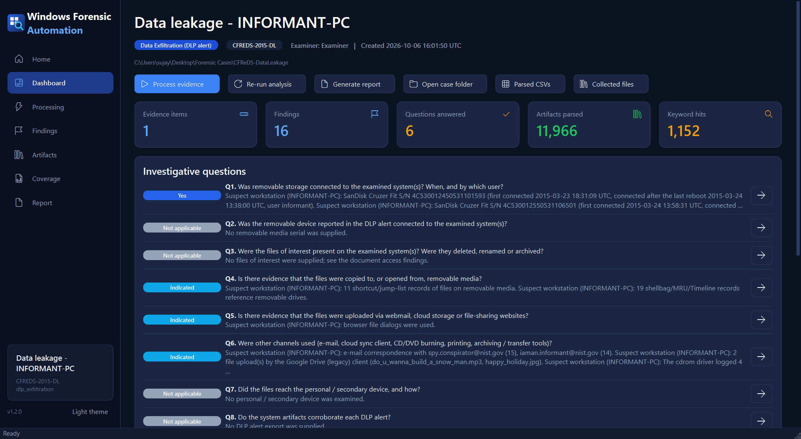
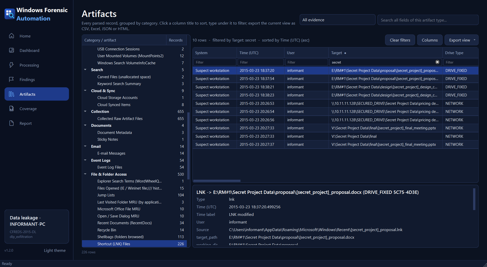
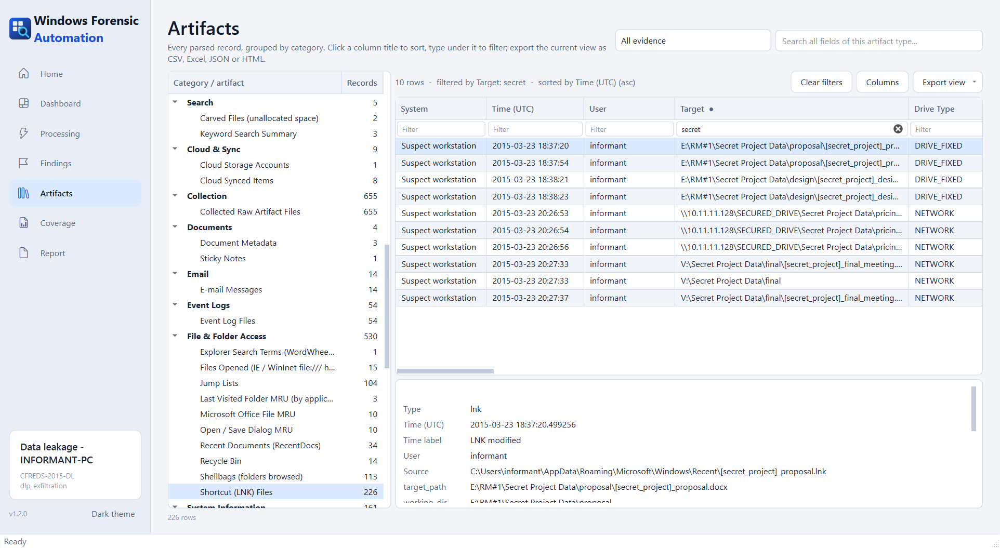
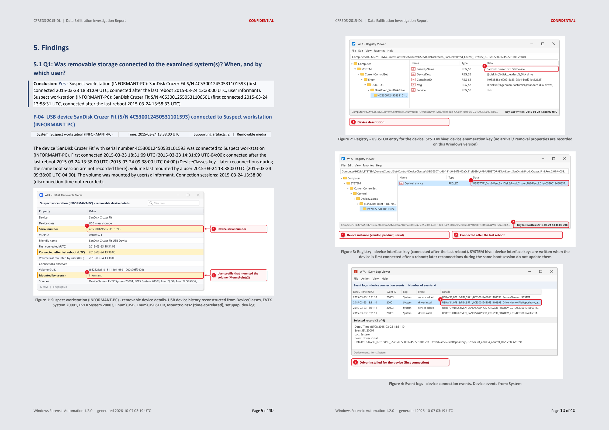
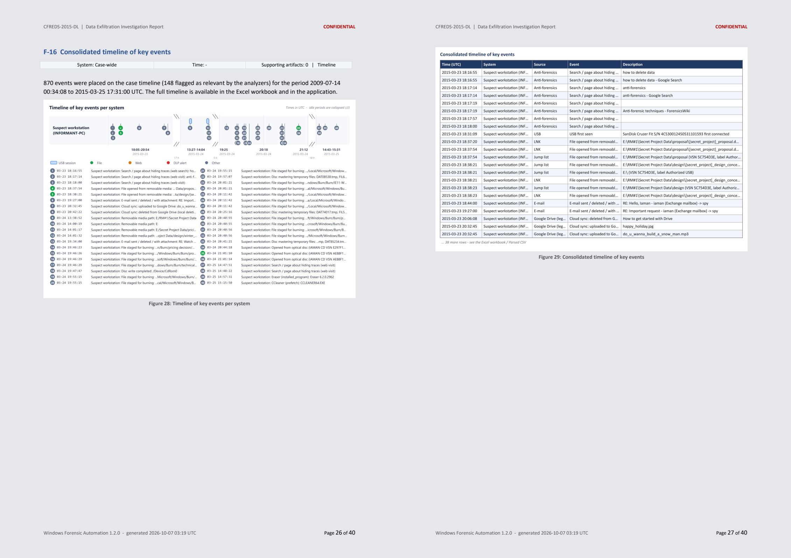
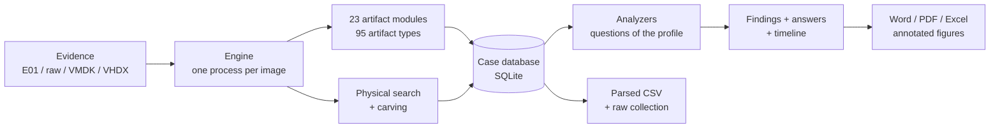

<div align="center">


# Windows Forensic Automation

**Load a disk image. Pick the type of case. Get answers, every parsed artifact, and a court-ready report.**

Free and open-source automation of the repetitive part of Windows forensic examinations: DLP and data exfiltration, USB activity, malware, phishing,
ClickFix, remote-access / RMM abuse, ransomware and account compromise.

[](https://github.com/sujayadkesar/windows-forensic-automation/actions/workflows/ci.yml)
[](LICENSE)


[](docs/VALIDATION.md)

[Download](https://github.com/sujayadkesar/windows-forensic-automation/releases) · [Quick start](#quick-start) · [Case types](#case-types) ·
[Validation](#validated-against-a-published-answer-key) · [Sample report](docs/sample-report) · [Contributing](CONTRIBUTING.md)



</div>

---

## Why

Most Windows cases repeat the same work:
- Was a USB stick plugged in, and when?
- Which files were opened from it?
- Did the user upload anything to the cloud, burn a disc, mail an attachment or wipe traces?
- What ran on the box, and how did it persist?

Commercial suites answer this well but cost more than many teams, schools and independent examiners can spend.

**Windows Forensic Automation** does that examination end to end:

1. **Parses** 95 Windows artifact types from E01 / Ex01 / raw / VMDK / VHD(X) images, deleted records included.
2. **Searches every byte** of the disk. Each hit is attributed to allocated file, slack, unallocated space, `$MFT`, `$LogFile`, `$UsnJrnl`, `$I30`, pagefile, hiberfil, Volume Shadow Copy or unpartitioned space.
3. **Answers the investigative questions** of the case type you chose. Each answer is **Yes / Indicated / No evidence found / Not applicable / Inconclusive** and cites its artifacts.
4. **Writes the report.** You get Word, PDF and Excel, with annotated, screenshot-style figures of the actual records.
5. **Keeps everything verifiable:**
   - a CSV of every parsed artifact;
   - a `SuperTimeline.csv`;
   - the original artifact files copied out with MD5 / SHA-1 / SHA-256.

   You can check any result by hand or in your tool of choice.

> Forensic output is only useful if it is right. The tool is validated against the NIST CFReDS answer key, and its figures
> never contain values that are not in the evidence. See [Accuracy first](#accuracy-first).

## Case types

| Profile | Answers | Typical trigger |
|---|---|---|
| **Data exfiltration (DLP alert)** | USB devices and serials, files opened from removable / network drives, webmail and cloud uploads, CD/DVD burning, e-mail attachments, printing, archives, the personal device, alert-by-alert corroboration | DLP alert with file names / hashes, or just "he plugged in a USB stick" |
| **Removable media review** | Every device, connection sessions, volume serials and labels, user, files and folders accessed | USB policy violation |
| **Malware infection** | Static sample analysis (PE, Office macros, PDF, LNK, scripts, archives, YARA) and a hunt on the image: presence, execution, delivery, persistence, network IOCs | EDR / AV alert, suspicious file |
| **ClickFix / fake CAPTCHA** | The pasted Run-box / terminal command, the lure page, the payload and what followed | "Verify you are human" page asked to paste something |
| **Phishing** | Risky e-mails (including deleted ones still in the Windows Search index), opened attachments, Office spawning interpreters, mounted disk images | Reported phishing mail |
| **Remote access / RMM abuse** | AnyDesk, TeamViewer, ScreenConnect, RDP sessions and sources | Tech-support scam, intrusion |
| **Ransomware** | Encryption window, encryptor, ransom notes, precursors (VSS deletion, defense tampering), entry point | Encrypted files |
| **Account compromise** | Logons by type and source, brute force, account and group changes, explicit credentials | Unexpected logons |
| **General triage** | All of the above, when there is no allegation yet | New device in a case |

Profiles are YAML files. [Add your own](CONTRIBUTING.md#1-profiles-case-types) without writing code.

## Validated against a published answer key

The NIST [CFReDS Data Leakage Case](https://cfreds-archive.nist.gov/data_leakage_case/) is a public Windows 7 image of an
employee who leaks confidential files by USB, cloud, e-mail and CD-R and then wipes traces. NIST publishes the answers.
`tests/validation` checks the tool's output against them:

| NIST question | What is checked | Result |
|---|---|---|
| Q3-Q9 | OS, time zone, computer name, accounts and logon counts, last logon, IP address | ✅ |
| Q10, Q16, Q17 | Installed applications, all web search keywords, Explorer search "secret" | ✅ |
| Q22 | Both USB sticks, serials, first connection times, connection after reboot, volume label `IAMAN $_@` | ✅ |
| Q24-Q28 | Network share `\\10.11.11.128\secured_drive`, folders traversed and files opened on RM#2 and the share | ✅ |
| Q29-Q31 | Google Drive account, uploaded and deleted files with times | ✅ |
| Q32-Q35 | CD burning: 4 burn times (cdrom event 133), method, every file staged for the disc, files opened from the CD | ✅ |
| Q21, Q45 | E-mails including deleted ones and the attachment `space_and_earth.mp4` (Windows Search index) | ✅ |
| Q23, Q36, Q37 | `$UsnJrnl` paths of renamed / deleted files, resignation letter timestamps, XPS print | ✅ |
| Q52 | Eraser wiping `Desktop\temp` (7 random renames, then delete) | ✅ |

Details and how to reproduce: [docs/VALIDATION.md](docs/VALIDATION.md).

## Accuracy first

- **No fabricated values.** Figures only draw values read from the evidence:
  - no invented registry rows, MRU values or icons;
  - no "last connected" time that the artifact does not actually record.

  Windows 7 USB times are labeled "connected after the last reboot", as their source (the DeviceClasses key) means.
- **Sequence-checked paths.** `$UsnJrnl` and deleted-file paths are resolved by MFT reference *and* sequence number. A
  folder whose MFT record was reused is rebuilt from the journal's own history, using the name it had at that time.
  Otherwise the path says `<unknown folder>` rather than guessing.
- **Specification-checked parsers.** Examples:
  - shortcut network targets honor the ValidDevice flag (MS-SHLLINK);
  - burn events are filtered by provider, not only by event ID;
  - wiper detection needs four or more renames within 3 seconds followed by a delete. Ordinary Office saves never trigger it.
- **Evidential wording.** Conclusions use evidential terms with no high/medium/low risk ratings. Anything inferred is
  labeled as inferred ("linked by arrival time", "Indicated").
- **Coverage matrix.** The report lists every location examined and its result, so "nothing found" is distinguishable from
  "not present" or "not examined".

## Screenshots

| Artifact grid: filter under every column, sort, export the view | Light theme |
|---|---|
|  |  |

| Report: findings with annotated figures | Report: timeline of key events |
|---|---|
|  |  |

Full sample: [CFReDS data leakage report (PDF)](docs/sample-report).

## Quick start

### Windows executable (no Python needed)

1. Download `WindowsForensicAutomation-<version>-win64.zip` from [Releases](https://github.com/sujayadkesar/windows-forensic-automation/releases) and unzip it.
2. Run `WFA.exe` and choose **New case**.
3. Pick a case type and add the evidence, plus anything you already know: DLP export, file hashes, USB serial, IOCs, samples.
4. Press **Start**. The report opens when processing finishes.

### From source

```
git clone https://github.com/sujayadkesar/windows-forensic-automation
cd windows-forensic-automation
python -m venv .venv
.venv\Scripts\pip install -r requirements.txt
.venv\Scripts\python -m winforensics            # desktop application
```

### Command line (batch / scripted cases)

```
wfa-cli new --case D:\Cases\2026-041 --profile dlp_exfiltration ^
    --evidence "E:\img\laptop.E01:source:Corporate laptop" --evidence "E:\img\usb.dd:removable:USB stick" ^
    --dlp-export alerts.csv --reference D:\confidential_files --keyword "Project Falcon" --run
wfa-cli run --case D:\Cases\2026-041 --phases analysis,report     # re-run analysis after adding inputs
wfa-cli profiles
```

## What you get

```
<case folder>
├── reports\     Word report, PDF, Excel workbook of every artifact, plain-text summary for tickets / e-mail
├── Parsed\      E01_<label>\SuperTimeline.csv           every dated artifact, one chronological list
│                E01_<label>\File System\FileSystem_C.csv full MFT incl. deleted records, $SI / $FN times, ADS
│                E01_<label>\File System\UsnJrnl_J.csv    change journal with sequence-checked paths
│                E01_<label>\Event Logs - all records\    every record of every EVTX
│                E01_<label>\SRUM - all tables\           app / network usage with names resolved
│                E01_<label>\<category>\<artifact>.csv    registry, browsers, LNK, jump lists, shellbags, USB, ...
├── Collected\   original artifact files (hives + logs, EVTX, Prefetch, SRUM, $MFT, $LogFile, $UsnJrnl, browser DBs,
│                Windows.edb, ...) with _manifest.csv (MD5 / SHA-1 / SHA-256)
└── exports\     files of interest, carved files, keyword hit context
```

## What it examines (Windows 7 - 11)

| Area | Artifacts |
|---|---|
| File system | `$MFT` incl. deleted records, `$SI` / `$FN` timestamps and anomalies, ADS / Zone.Identifier, `$UsnJrnl` (sequence-checked paths, wiper patterns), FAT / exFAT incl. deleted entries |
| Removable media | USBSTOR / SCSI / WPD, Properties 0064 / 0066 / 0067, DeviceClasses, MountedDevices, MountPoints2, VolumeInfoCache, EMDMgmt, setupapi, Partition/Diagnostic, Kernel-PnP, UserPnp |
| Optical media | `cdrom` event 133, IMAPI sessions and burn staging files (MFT + `$UsnJrnl`), CD Burning registry, `<CDBURN>` shellbags, shortcuts to discs |
| File and folder access | LNK, jump lists, shellbags, RecentDocs, Open/Save and LastVisited MRU, Office MRU, TypedPaths, WordWheelQuery, Windows Timeline, IE / WinInet `file:///` history, Recycle Bin |
| Execution | Prefetch, Amcache, Shimcache, BAM/DAM, UserAssist, MUICache, PCA, SRUM, process-creation events |
| Browsers | Chrome / Edge / Brave / Opera / Vivaldi, Firefox, Internet Explorer and Edge legacy (`WebCacheV01.dat`, `index.dat`) |
| E-mail, cloud, notes | Outlook PST / OST, Windows Search index (`Windows.edb`), OneDrive, Google Drive (DriveFS and the legacy client), Dropbox, Box, MEGA, Sticky Notes |
| Event logs | 39 channels, full CSV dumps, PowerShell script-block reassembly, chunk-level recovery of damaged EVTX |
| Persistence and remote access | Run keys, services, scheduled tasks, WMI subscriptions, startup folders, RMM tools, RDP |
| Raw data | Keyword search of every byte (ASCII / UTF-16LE) with area attribution, carving of documents, archives, databases, shortcuts and executables, pagefile / hiberfil strings |

## Architecture



- **Modules** (`winforensics/modules`) parse artifacts into normalized records.
- **Analyzers** (`winforensics/analyzers`) correlate records across artifacts and devices, and answer the profile's questions.
- **Profiles** (`winforensics/profiles/*.yaml`) choose the inputs, modules, analyzers and questions.

## Contributing

New case types, artifacts and detections are very welcome. Tools, domains and command patterns are plain YAML; a new
parser is a single Python class. See [CONTRIBUTING.md](CONTRIBUTING.md).

If you find a result that is not in the evidence, please open a **Wrong result** issue. Accuracy bugs come first.

## Roadmap

- Thumbcache, Windows 11 Search (`Windows.db`), Windows Timeline (`ActivitiesCache.db`) enrichment.
- Linux / macOS triage profiles.
- Memory image support (Volatility 3 integration).
- More validation against public reference images.

## License

[GNU AGPL v3.0 or later](LICENSE). Free to use, study, share and improve; derivatives must stay open. See
[THIRD_PARTY_NOTICES.md](THIRD_PARTY_NOTICES.md) for the libraries this project builds on, notably
[dissect](https://github.com/fox-it/dissect) by Fox-IT and the [libyal](https://github.com/libyal) libraries by Joachim Metz.

## Disclaimer

The tool assists a qualified examiner; it does not replace one. Review and verify every finding before relying on it.
The parsed CSV files and the raw artifact collection are there for exactly that.
